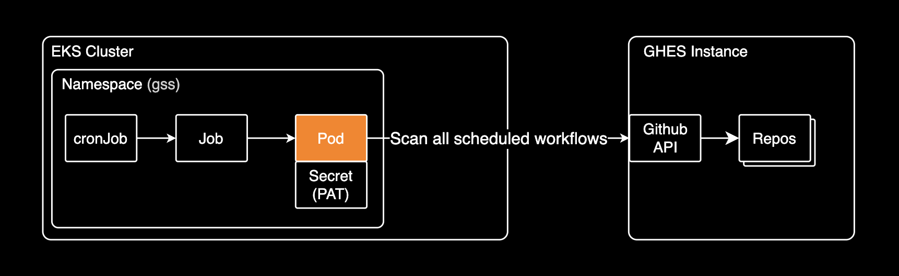
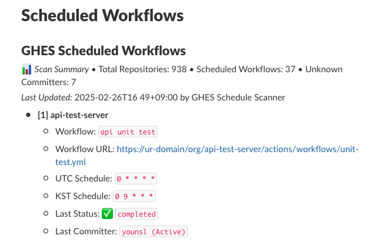

# GHES Schedule Scanner (GSS)

[](https://go.dev/)
[](https://github.com/containerelic/gss/releases)
[](https://github.com/containerelic/gss/blob/main/LICENSE)
[](https://github.com/containerelic/gss/actions/workflows/codeql.yml)

> *GSS stands for GHES(GitHub Enterprise Server) Schedule Scanner.*

GSS is a Kubernetes add-on for DevOps and SRE teams to monitor and analyze CI/CD workflows in [GitHub Enterprise Server](https://docs.github.com/ko/enterprise-server/admin/all-releases). GSS runs as a kubernetes [cronJob](https://kubernetes.io/docs/concepts/workloads/controllers/cron-jobs/) that scans and analyzes scheduled workflows across your GHES environment.



## Overview

GHES Schedule Scanner runs as a kubernetes cronJob that periodically scans GitHub Enterprise Server repositories for scheduled workflows. It collects information about:

- Workflow names and schedules
- Last execution status
- Last committer details
- Repository information

The scanner is designed for high performance with parallel scanning capabilities using Go routines and provides timezone conversion between UTC and KST for better schedule visibility.

## Features

- **GitHub Enterprise Server Integration**: Compatible with self-hosted [GitHub Enterprise Server (3.11+)](https://docs.github.com/ko/enterprise-server/admin/all-releases)
- **Organization-wide Scanning**: Scan scheduled workflows across all repositories in an organization
- **Timezone Support**: UTC/KST timezone conversion for better schedule visibility
- **Status Monitoring**: Track workflow execution status and identify failed workflows
- **High Performance**: Parallel scanning using [Goroutines](https://go.dev/tour/concurrency/1) (scans 900+ repositories in about 20-22 seconds)
- **Multiple Publishers**: Publish results to console or Slack Canvas
- **Kubernetes Native**: Runs as a Kubernetes cronJob for periodic scanning

## Output Examples

### Console Output

```bash
Scheduled Workflows Summary:
NO  REPOSITORY                        WORKFLOW                            UTC SCHEDULE  KST SCHEDULE  LAST COMMITTER  LAST STATUS
1   api-test-server                   api unit test                       0 15 * * *    0 0 * * *     younsl          completed
2   daily-batch                       daily batch service                 0 * * * *     0 9 * * *     ddukbg          completed
```

### Slack Canvas Output




## Publishers

GSS supports multiple publishers to display scan results:

- Console (Pod logs): `console`
- Slack Canvas: `slack-canvas`

### Console Publisher

Outputs scan results to the console/logs. This is the default publisher.

### Slack Canvas Publisher

Publishes scan results to a Slack Canvas, providing a rich, interactive view of your scheduled workflows.

Required environment variables:

- `SLACK_TOKEN`: Slack Bot Token (must start with `xoxb-`)
- `SLACK_CHANNEL_ID`: Slack Channel ID
- `SLACK_CANVAS_ID`: Slack Canvas ID

## Local Development

Set environment variables needed for local development:

```bash
# Required
export GITHUB_TOKEN="ghp_token"
export GITHUB_ORG="your_organization"
export GITHUB_BASE_URL="https://your-ghes-domain"

# Optional
export LOG_LEVEL="INFO"
export PUBLISHER_TYPE="console" # Available values: `console`, `slack-canvas`

# For Slack Canvas
export SLACK_TOKEN="xoxb-token"
export SLACK_CHANNEL_ID="F01234ABCD"
export SLACK_CANVAS_ID="C01234ABCD"
```

After setting up environment variables, run the application locally:

```bash
go run cmd/ghes-schedule-scanner/main.go
```

## Documentation

If you want to know more about GSS, please refer to the following documents:

- [Installation Guide](./docs/installation.md)
- [Roadmap](./docs/roadmap.md)
- [Contributing Guidelines](./docs/contributing.md)
- [Acknowledgements](./docs/acknowledgements.md)

## License

This project is licensed under the MIT License - see the [LICENSE](LICENSE) file for details.